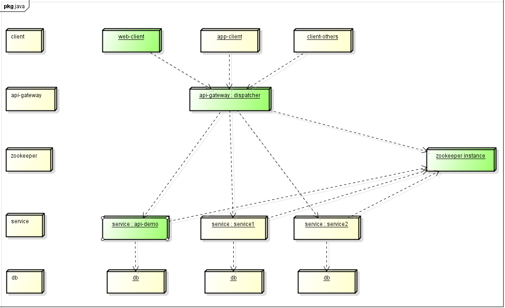

# Zookeeper注册发现服务

## 1. zookeeper原理介绍

- [分布式服务框架 Zookeeper -- 管理分布式环境中的数据](https://www.ibm.com/developerworks/cn/opensource/os-cn-zookeeper/)

## 2. 基础微服务简单架构与demo说明



- api-gateway实例：dispatcher(/microservices/api-gateway/dispatcher)
- web-client实例：web-client(/microservices/apps/web-client)
- api-service实例：api-demo(/microservices/services/api-demo)

- zookeeper：注册中心
- spring boot应用api-demo，作为一个service微服务实例，依赖一个服务注册组件service-registry(/microservices/services/service-registry)，实现服务向zookeeper注册。启动api-demo即可向外提供服务并注册到zookeeper。
- Nodejs应用dispatcher，作为api网关，它使用一个node-zookeeper-client组件，连接zookeeper，根据client传递过来的service名称，发现服务，并转发请求到目标服务中。
- web-client，即是前端web客户端，它只向api网关dispatcher发送请求，并且在请求的header中传递Service-Name字段，指明要请求的服务名称.

## 3. 运行demo

### 3.1 bin/zkServer.sh start启动zookeeper

没有zookeeper请先下载：http://zookeeper.apache.org/releases.html


### 3.2 打包运行api-demo
```
cd ../microservices/services/api-demo
mvn clean package
java -jar api-demo-1.0.0.jar
```
或者直接导入项目，运行ApiDemoApplication启动.


### 3.3 运行api网关dispatcher
```
cd ../microservices/api-gateway/dispatcher
node app.js
```

如果想每次更改代码后即刻生效，可使用supervisor模块启动应用：
```
npm install supervisor -g
supervisor app.js
```

如果需要Node应用在发生异常停止时能够重新启动，可使用forever模块启动应用：
```
npm install forever -g
forever app.js
```
forever app.js表示在前台启动，想要后台启动，使用命令：
```
forever start app.js
```

### 3.4 运行web-client，访问首页，进行服务请求.
```
cd ../microservices/api-gateway/dispatcher
node app.js
```
访问：http://localhost:9001/


