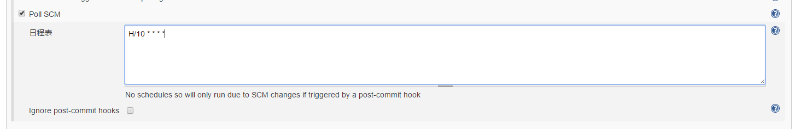

# Jenkins执行自动化的构建


## 1. Jenkins安装运行

### 1.1 docker方式安装运行

docker拉取镜像：
```
docker pull jenkinsci/jenkings
```

启动容器的方式运行jenkins：
```
docker run -d -u root -m 500m -p 8080:8080 -v ~/jenkins:/var/jenkins_home --name jenkins jenkinsci/jenkins
```

后台查看jenkins日志：
```
docker logs -f jenkins
```

会看到一条解锁jenkins的key：
```
unlock jenkins:c1bbf6aaa7aa4bd99cfcc0fb4a56ec83
```

访问：http://localhost:8080，首次访问，需要输入key
复制unlock jenkins key，输入，完成.

后面就是安装插件，可以根据自己需要安装，也可以安装jenkins建议的插件.

### 1.2 war包方式部署运行

jenkins官网，下载最新稳定版本jenkins的war包.

放进准备好的tomcat的webapps下，启动tomcat即可运行。

### 1.3 Centos的yum安装

设置yum源
```
sudo wget -O /etc/yum.repos.d/jenkins.repo https://pkg.jenkins.io/redhat/jenkins.repo
sudo rpm --import https://pkg.jenkins.io/redhat/jenkins.io.key
```

安装：
```
yum install jenkins
```

修改端口和用户(可选，如果有需要修改端口和运行jenkins用户的需要，可以修改):
```
vi /etc/sysconfig/jenkins
```

启动jenkins：
```
service jenkins start
```

设置开机启动
```
chkconfig jenkins on
```


## 2. jenkins必要设置

基本上安装后第一次运行按照jenkins建议的插件，基本够用。有特殊需要再添加。

要使用git，需要安装git相关插件。

新版本jenkins不再默认设置maven，有需要maven功能的，可以在设置的工具管理页面配置一个maven。

## 3. Jenkins搭建持续集成系统

这个步骤的目标是实现使用jenkins进行项目构建：从代码仓库gitlab/github/svn等拉源代码，通过maven进行编译打包，最后将构建成功输出的程序包进行归档。


### 3.1 创建构建任务

创建一个新任务，填任务名称，选择构建什么项目


配置git仓库。如果需要账号密码认证，填上。


添加一个构建步骤：


选择maven targets的选项：


添加一个构建后步骤，将jar包归档


输入框中输入需要存档的文件：


### 3.2 手工构建


### 3.3 实现自动执行构建

我们希望代码提交到git后，自动触发构建。

构建触发器，选择“Poll SCM”：


输入“H/10 * * * *”。表示有最新代码提交后，等10分钟就会触发自动构建


## 4. 使用jenkins实现自动化发布

### 4.1 自动发布jar包


在输入框中输入shell命令来运行项目：

```
java -jar $WORKSPACE/xxx/target/xxx.jar --server.port=10800
```

仅仅是这样还不够，需要考虑正在运行中的应用的关闭、后台启动、生产环境如何部署发布等众多细节，继续完善的话，是一条路。另一条路是使用docker。

### 4.2 自动发布Docker容器

使用docker容器发布项目，我们要达到的目标是：
1）开发人员将代码同步到git仓库，随后触发jenkins自动构建
2）jenkins调用maven进行构建，生成jar包。
3）根据当前构建过程，生成一个docker镜像，将其推送至局域网内的docker registry中，供生产环境随时获取并发布。
4）根据生成的docker镜像，运行一个docker容器（若当前存在该镜像，则先移除该镜像）

前2步在前面的步骤已实现，以下将完成后两步：

在构建后步骤中选择shell脚本，在脚本框中输入具体的docker镜像构建和推送：


```
API_NAME="spring-boot-docker"
API_VERSION="1.0.0"
API_PORT=8101
IMAGE_NAME="127.0.0.1:5000/com.iyihua/$API_NAME:$BUILD_NUMBER"
CONTAINER_NAME=$API_NAME-$API_VERSION

cd $WORKSPACE/target
cp classes/Dockerfile .

docker build -t $IMAGE_NAME .

docker push $IMAGE_NAME

cid=$(docker ps | grep "$CONTAINER_NAME" | awk '{print $1}')
if [ "$cid" != "" ]; then
  docker rm -f $cid
fi

docker run -d -p $API_PORT:$API_PORT --name $CONTAINER_NAME $IMAGE_NAME

rm -f Dockerfile
```